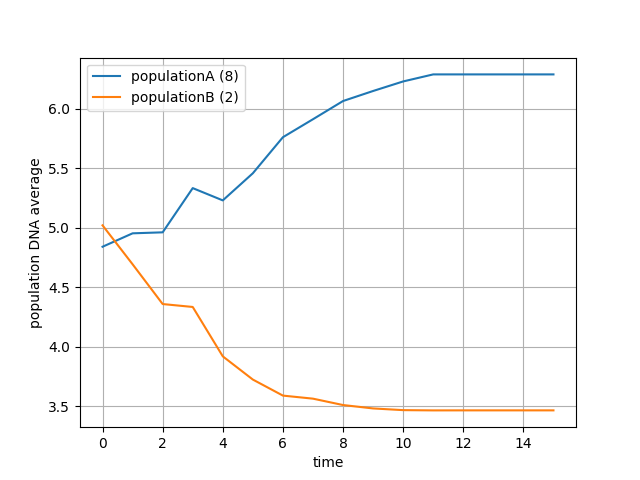
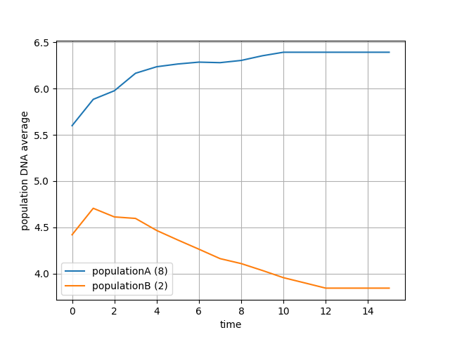
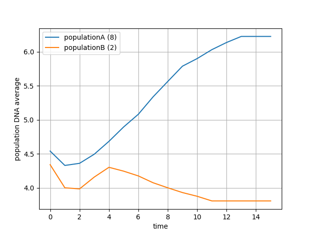
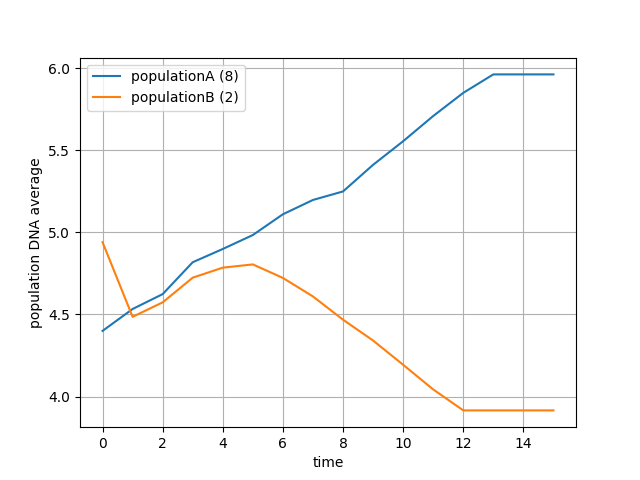
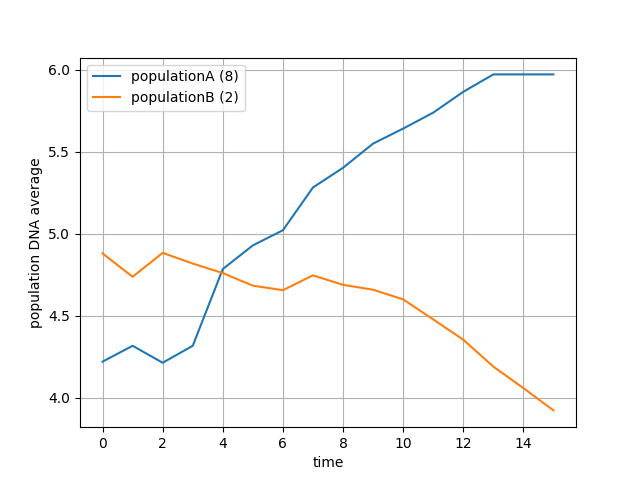

basis of evolution
==================

the elegance and beauty of evolution is that it didn't introduce
anything we didn't know before about nature, it just tells us that
given some observable facts we should have got it very long ago.

those observable facts are represented in the following sub-sections.

natural pressure
----------------

nature always puts pressure on us, and always introduces challenges we
have to overcome to survive.

ranking
-------

we are not all the same in the eyes of nature, different animals are
awarded or punished based on how they perform in life challenges.

inheritance
-----------

any new born baby gets his traits constructed from his parent's traits,
not all traits are hereditary traits though, but those don't contribute
to biological evolution so they are irrelevant here

natural mutations
-----------------

the randomness salt in the gene soup.

it happened many times that a child has been born without a sexual
organs or maybe deformed ones, since obviously this couldn't be
inherited, it has to be a completely new gene introduced in this poor
baby

mutations are very crucial in the evolution mechanism, you can consider
it the experimentation ground of species, a field of trying new ideas
and testing them by putting them into action.

sexual selection
----------------

if a new trait is beneficial in many ways, but not sexy enough to
attract the opposite sex to reproduce new beings with this trait, it
will die young. on the other hand a new trait may succeed only because
it attracts the other sex regardless of how beneficial it is on other
aspects.

but i should say here that's sexual selection and natural selection
aren't always independent, for example healthy males are more
attractive in females eyes, that's because nature selected females who
select those males, as those females produce healthy children

Geographical isolation
----------------------

for two groups to develop new traits in different directions they must
be physically apart, or in the jargon there must be two gene pools. this
happens in nature in several ways, but the primary cause is natural
disasters.

what are Species
================

from Wikipedia

> In biology, a species is the basic unit of classification and a
> taxonomic rank, as well as a unit of biodiversity, but it has proven
> difficult to find a satisfactory definition. Scientists and
> conservationists need a species definition which allows them to work,
> regardless of the theoretical difficulties

species are actually just an arbitrarily chosen unit for biodiversity,
or a measure of disparity or unlikeness. there is no natural distinction
between differences between individuals and differences between species
other than that differences between species are much more.

why proving one trait is enough
-------------------------------

for some reason the idiotic idea that says evolution is true inside the
same specie but not true outside it has found its way into some
people's mind. apparently its nothing more than a last try to keep
something for god while superficially believing in evolution.

by the definition in *the previous section *, if evolution is true for
one trait, the process by necessity will lead to speciation.

reproducing the nature
======================

the past sections was an introduction but in this section we will
discuss the code in some detail.

animals
-------

what we need is some sort of a data type that will simulate the concept
of animals by having the relevant attributes real animals have, such as
age, some form of genetic code, parents, sexual abilities, gender, and a
geographical location.

you guessed it, a python class.

```python

# global constants
DNA_LOW = 0   # minimum DNA value
DNA_HIGH = 11 # maximum DNA value
DNA_LEN = 5 # how many cells in each DNA array
ISLANDA_TYPICAL = 8  #the trait islandA demand
ISLANDB_TYPICAL = 2  #the trait islandB demand
INITIAL_POPULATION_NUMBER = 10
NUMBER_OF_GENERATIONS = 15
MAX_POPULATION = 40000 
# just to save time cause mating the whole population after 4000 will take ages

# some calculation constants
EXP = 2
FACTOR = 1/8
translate = lambda rank: int((rank**EXP)*FACTOR)

class JesusException(Exception):
    """ raised whenever a child is born without a father 
(this will not be raised actually its just a joke :D)
"""
    pass

def calc_rank(dna, typical):
    rank = sum(abs(dna - typical))/DNA_LEN
    return 8-rank


class Animal():
    def __init__(self, island, mom=None, dad=None):

        if (dad is None) and (mom is None):
            # generation zero
            self.dna = np.random.randint(DNA_LOW, DNA_HIGH, DNA_LEN)
        elif (dad is not None) and (mom is not None):
            midpoint = int(DNA_LEN/2)
            self.dna = np.append(dad.dna[:midpoint], mom.dna[midpoint:])
            random_index = np.random.randint(DNA_LEN)
            self.dna[random_index] = np.random.randint(DNA_LOW, DNA_HIGH)
        else:
            raise(JesusException)

        if island == 'A':
            self.rank = calc_rank(self.dna, ISLANDA_TYPICAL)
        elif island == 'B':
            self.rank = calc_rank(self.dna, ISLANDB_TYPICAL)

        self.island = island
        self.dad = dad
        self.mom = mom
        self.gender = np.random.randint(2) # 0 male 1 female
        self.power = translate(self.rank)
        self.time =  translate(self.rank)

```

first we define some global constants (not all of those makes sense just
yet but they will soon).

next we define the Jesus exception and the calc~rank~ function. see *DNA
and ranking* .

the animal class code is mostly straight forward except for few points:

-   we permit that an animal can exist without parents because we have
    to start with initial population which has animals of self.mom and
    self.dad equals None
-   the animal parents self.mom and self.dad are both of type animals
    and have the same set of attributes (every one of them has his
    self.mom and self.dad).
-   self.power represents sexual power self.time represent longevity
    (yeah poor naming).
-   island A and island B represent the geographical isolation. see*
    reproducing Geographical isolation*.
-   there is things i will explain later in this document sometimes you
    will need to get back here to see the class definition, i will
    points to this section whenever needed.

### DNA and ranking

in reality DNA can be simplified as a list of numbers, and that's what
we will do exactly, we will assign every animal an attribute self.dna
which holds bunch of numbers, this list can be of any length
theoretically but it is constrained by the computational power you have.
for me i found that a list of 5 will output in a sensible time, if you
have a more powerful machine you can increase DNA~LEN~ to the value you
want.

the range of numbers any cell can holds can be arbitrarily chosen as
well. i choose a range from 0 to 11

the picture here is as follows:

every animal has associated list. say animalA has DNA \[1, 4, 3, 1, 9\]
and animalB has DNA \[7, 3, 5, 8, 8\]. based on those numbers we will
compute how this animal is functioning, but before that we have to
attach a meaning for those number, or way to say whether \[1, 4, 3, 1,
9\] will perform more than \[7, 3, 5, 8, 8\]? and why?. so we have to
introduce the rank

we can choose any mathematical relation between those number to compute
the rank, but for the sake of simplification we will say that for a
certain environment there is a typical number for example 7, and based
on how far each cell from that number is, we will decide how this animal
will perform.

so based on that definition and using the previous animal examples A and
B, animalB will perform better than animalA in that environment because
\[7, 3, 5, 8, 8\] has cells which are closer to 7 (sum of differences)
than the cells of \[1, 4, 3, 1, 9\]. we represent that mathematically by
giving animalB a rank higher than animalA

if there is another environment that demand the number 5, animalA will
perform better therefor it will have higher rank than animalB. its
important to understand that the rank is local to the environment, there
is no such thing as an absolute rank (as in real life).

here is the definition of calc~rank~ function:

```python
def calc_rank(dna, typical):
    rank = sum(abs(dna - typical))/DNA_LEN
    return 8-rank
```

this equation just translate the sentence \"how far the cells are from
the typical number\" to a number.

### reproducing mutations

lets look closer to this code snippet

```python
elif (dad is not None) and (mom is not None):
    midpoint = int(DNA_LEN/2)
    self.dna = np.append(dad.dna[:midpoint], mom.dna[midpoint:])
    random_index = np.random.randint(DNA_LEN)
    self.dna[random_index] = np.random.randint(DNA_LOW, DNA_HIGH)
```

this code is responsible for computing the new born dna from the dad's
and mom's by taking half the mom's dna and half of the dad's and
attaching them end to end, pretty much exactly what happens in real
life.

but after that it takes one cell and randomly alter it, to emulate the
mutation process discussed in *natural mutations*.

### reproducing Geographical isolation

for the evolution process to take place there must be a geographical or
environmental isolation, that's why i defined a self.island attribute
to store the home of each animal, the island variable is given to the
animal constructor at creation time.

every island has its own typical value, hence the constants
ISLANDA~TYPICAL~=8 and ISLANDB~TYPICAL~=2.

### initial population and mean

the first thing we do in every trial we initiate a population of size
INITIAL~POPULATIONNUMBER~.

```python
populationA = [Animal('A') for i in range(INITIAL_POPULATION_NUMBER)]
populationB = [Animal('B') for i in range(INITIAL_POPULATION_NUMBER)]
means = [get_mean_vals(populationA, populationB)]
```


then calculate the mean values using the function get~meanvals~

```python
def get_mean_vals(populationA, populationB):
    dnaA = np.concatenate([animal.dna for animal in populationA])
    dnaB = np.concatenate([animal.dna for animal in populationB])
    return np.mean(dnaA), np.mean(dnaB)
```

### translating rank to sexual power and longevity

to estimate how long the animal will live and how many babies it will
give every mating season, we will use of course the rank. the exact
relation between rank and longevity can be anything as long as they are
directly proportional.

# some calculation constants
```python
EXP = 2
FACTOR = 1/8
translate = lambda rank: int((rank**EXP)*FACTOR)
```

i used an exponential relation to speed up things a little bit, cause
again its a matter of computational power.

and in the animal class definition


```python
self.power = translate(self.rank)
self.time =  translate(self.rank)
```

mating and mating season
------------------------

the mating function is fairly straight forward.

```python
def mate(couple):
    mama,papa = couple
    babies_number = min(mama.power, papa.power)
    return [Animal(mama.island, mom=mama, dad=papa) for i in range(babies_number)]
```

couple is a tuple of male and a female. there is a function called
create~couples~ that takes a list of males and a list of females and
return a list of couples. this function discussed in the next section.

### reproducing sexual selection

i really didn't simulate the independent sexual selection, i reused the
rank to sort males and females and make the high ranked females choose
the high ranked males. maybe sometime in the future i will write a
separate rank for sexual selection and see how things will go.

```python
def create_couples(females, males):
    """ takes sorted females and males by rank k """
    couples  = []
    married_men = set()
    for female in females:
        for male in males:
            if (not haram(female,male))and(male not in married_men) :
                couples.append((female,male))
                married_men.add(male)
                break
    return couples
```

the haram function returns true if the males or females are direct
relatives.

```python
def haram(female, male):
    return (male == female.dad) or (male.mom == female) \
            or ((male.mom == female.mom) and \
                  (male.dad == female.dad) and male.mom is not None)
```

### mating season

```python
def mating_season(population):
    kill_whos_time_has_come(population)
    decrement_time(population)
    females = [ animal for animal in population if animal.gender]
    males = [ animal for animal in population if not animal.gender]

    females = sorted(females, key = lambda f: f.rank)
    males = sorted(males, key = lambda m: m.rank)

    couples = create_couples(females, males)
    babies = []
    for couple in couples:
        babies += mate(couple)
    population += babies
```

the mating~season~ function takes the whole population and does three
things:

1.  kills who's time has come.
2.  decrements time of the whole population
3.  separates the population into males and females
4.  sort males and females by rank
5.  create couples using function create~couples~
6.  mates every couple
7.  adds the resulting output to the population

### the main loop

the main logic of the program is a loop of infinite trials, in every
trial we make the following:

1.  construct the initial population.
2.  do some printing to stdout.
3.  keeps track of how the mean values changes over time.
4.  calls the mating~season~ function for every island
    NUMBER~OFGENERATIONS~ times and stops whenever the population
    exceeded MAX~POPULATION~.
5.  produces the graphical plots.

```python
if __name__ == '__main__':
    ntrials = 0
    while True:
        print(f'-------------trial{ntrials}-------------')

        populationA = [Animal('A') for i in range(INITIAL_POPULATION_NUMBER)]
        populationB = [Animal('B') for i in range(INITIAL_POPULATION_NUMBER)]
        means = [get_mean_vals(populationA, populationB)]

        print('generation zero: ')
        print('the mean of population A dna', means[0][0])
        print('the mean of population B dna', means[0][1])

        iA, iB = 0, 0
        for i in range(NUMBER_OF_GENERATIONS):
            if len(populationA) < MAX_POPULATION:
                mating_season(populationA)
                iA += 1
            if len(populationB) < MAX_POPULATION:
                mating_season(populationB)
                iB += 1
            means.append(get_mean_vals(populationA, populationB))

        ntrials += 1

        print(f'after {min(iA,iB)} generations: ')
        print('the mean of population A dna', means[i][0] )
        print('the mean of population B dna', means[i][1])
        print('with diff ',  means[i][0] - means[i][1])

        plot_means(means)
```

output
======

running the program on my machine for four trails outputted the
following

```
-------------trial0-------------
generation zero: 
the mean of population A DNA 4.84
the mean of population B DNA 5.02
after 11 generations: 
the mean of population A DNA 6.290029719380465
the mean of population B DNA 3.46341901890929
with diff  2.826610700471175
-------------trial1-------------
generation zero: 
the mean of population A DNA 5.6
the mean of population B DNA 4.42
after 10 generations: 
the mean of population A DNA 6.393710352525346
the mean of population B DNA 3.8421905942027306
with diff  2.5515197583226157
-------------trial2-------------
generation zero: 
the mean of population A DNA 4.54
the mean of population B DNA 4.34
after 11 generations: 
the mean of population A DNA 6.22569350853549
the mean of population B DNA 3.8069981517701734
with diff  2.4186953567653164
-------------trial3-------------
generation zero: 
the mean of population A DNA 4.98
the mean of population B DNA 4.98
after 12 generations: 
the mean of population A DNA 6.239204199278249
the mean of population B DNA 3.901722968389635
with diff  2.337481230888614
```

here we clearly see that the mean value of DNA cells in the initial
population is approximately the same across both islands, but by letting
them reproduce for a number of generations the means in islandA (which
demands cells close to 8) shifted towards 8, while means in islandB
(which demands 2) shifted towards 2.

plots of those trials gives a better picture of how the means change
overtime rather than comparing the initial and final means.

here are plots of some trials.

  
  
